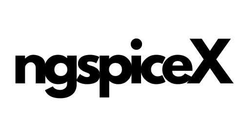

<div align="center">
  
</div>

[](https://github.com/shishir-dey/ngspiceX/actions/workflows/deploy.yml)

A modern browser-based SPICE circuit simulator built with React + Vite + Radix UI.

## Quick Start

```bash
# Clone and install
git clone https://github.com/shishir-dey/ngspiceX.git
cd ngspiceX
npm ci

# Development
npm run dev          # Start dev server at http://localhost:5173
npm run build        # Build for production
npm run preview      # Preview production build
npm run lint         # Run ESLint
npm run format       # Format code with Prettier
npm run clean        # Clean build cache
```

## Keyboard Shortcuts

| Shortcut | Action |
|----------|--------|
| `Ctrl/Cmd + Enter` | Run simulation (planned) |
| `Ctrl/Cmd + S` | Save netlist (browser download) |
| `Ctrl/Cmd + O` | Open netlist file |

## Development

### Project Structure

```
ngspiceX/
├── public/
│   ├── wasm/              # ngspice WASM files
│   └── examples/          # Sample netlists
├── src/
│   ├── components/        # React components
│   │   ├── EditorPane.jsx       # Text/schematic editor
│   │   ├── WaveformPane.jsx     # Plotly graph viewer
│   │   └── TerminalPane.jsx     # Console output
│   ├── hooks/            # Custom React hooks
│   │   ├── useNgspice.js        # WASM interface
│   │   └── useNetlistParser.js  # Netlist parsing
│   └── App.jsx           # Main application
└── vite.config.js        # Build configuration
```

### Building from Source

```bash
# Install dependencies
npm ci

# Development with hot reload
npm run dev

# Production build
npm run build

# Test production build locally
npm run preview
```

### Contributing

Contributions are welcome! Please:

1. Fork the repository
2. Create a feature branch (`git checkout -b feature/amazing-feature`)
3. Commit your changes (`git commit -m 'Add amazing feature'`)
4. Push to the branch (`git push origin feature/amazing-feature`)
5. Open a Pull Request

**Code Quality:**
- Run `npm run lint` before committing
- Format code with `npm run format`
- Ensure `npm run build` completes successfully

### Testing

Currently, the project has limited automated testing. Testing infrastructure setup is planned:

```bash
# Unit tests (planned)
npm test

# E2E tests (planned)
npm run test:e2e
```

## Known Limitations

1. **Simulations run on main thread** - Large simulations may freeze the UI
2. **No simulation abort** - Cannot cancel a running simulation
3. **Limited error recovery** - App may require reload after crashes
4. **Memory constraints** - Very large datasets may cause browser issues
5. **File I/O** - Uses browser download/upload (no native file system access)

## Roadmap

- [ ] Web Worker integration for non-blocking simulations
- [ ] Simulation abort/timeout functionality
- [ ] Comprehensive E2E testing with Playwright
- [ ] Enhanced error messages with netlist line highlighting
- [ ] Schematic editor improvements
- [ ] Circuit library and templates
- [ ] Export results to CSV/JSON

## Acknowledgments

Thanks to [@danchitnis/ngspice](https://github.com/danchitnis/ngspice) for providing the ngspice WASM build files that power the client-side simulation engine.

## License

MIT
